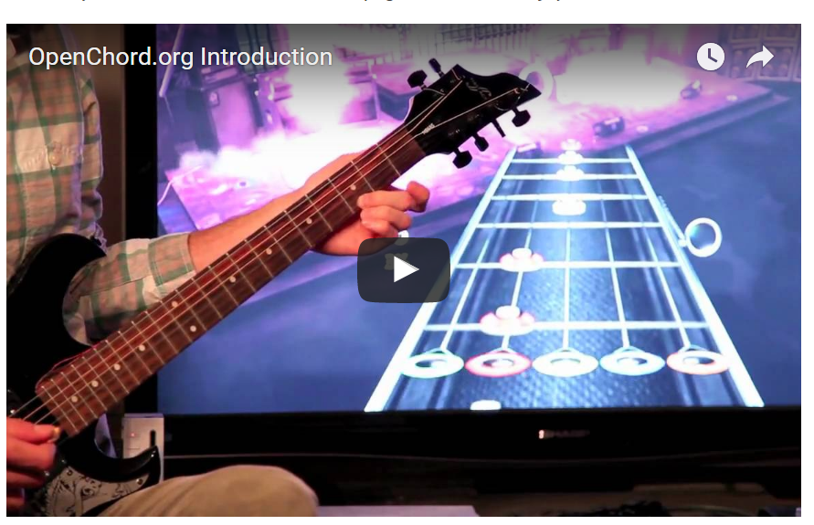

Virtual and Augmented Reality - Project 2017

# Presentation

Since the big project presentations are tomorrow, [here is mine :)](https://sway.com/LJc2ziR6jpuGUxak?ref=Link)

See you all :)

<iframe width="760px" height="500px" src="https://sway.com/s/LJc2ziR6jpuGUxak/embed" frameborder="0" marginwidth="0" marginheight="0" scrolling="no" style="border: none; max-width:100%; max-height:100vh" allowfullscreen webkitallowfullscreen mozallowfullscreen msallowfullscreen> </iframe>

# Motivation and Project Idea

Envisioned is a workstation application which uses computer vision methods and custom hardware modification on a real electric guitar to be able to track what the pupil does with their instrument. This enables real-time assistance and interactive behaviour to be scripted into the application to form a guitar lesson. A guided experience in form of tutorials or games with direct feedback (prompt user to perform a specific quest like play along this melody) while using the instrument is a natural thing to try. Another focus of the project could be giving the user the ability to configure widgets and augmentation content layers to fit their current needs in a free, "HUD" mode. These layers and widgets could be

* live timing statistics widget (lag behind accompanying beat or not)
* visualization of played notes on the scale
* play-along lyrics and chords (curated/crawled) content
* selector of which fretboard overlays to show, little harmonization tips, ...

Take for example this "real-life augmentation" of my guitar after spending too much time turning my head between a figure in a music theory book and the neck of the guitar:

It makes use of the fact that there are seven rainbow colors as well as seven steps on a common western musical scale. Thus, all positions with a round sticker are notes that fall on the *C Major / A minor* scale. It also looks just darn flashy. It *would* be nice to have that in a VR app, and to be able to turn off some of these colors, e.g. display only those that belong to a specific chord!

Here we arrive at something that I have long mauled over in my head, that music (in the rainbow-color level of abstraction at least) is wonderfully discrete. Of course that does not mean that anyone with a calculator is supposed to be able to make perfect sense of music that he hears or produces. In some aspects it is like a magic cube or chess: most people grasp the basic rules quite okay when first introduced ...

but principled, closed-loop feedback and expert knowledge seems almost indispensable for achieving high performance. Most people for example are not able to tell what the distance in half tone steps is from one note to another [citation needed]. It does not impact their enjoying music, but crossing that threshhold (e. g. by using this project in a fitting way) usually begets more frequent opportunities to improve the own model and intuition about the domain.

Let's see that augmented fretboard again in a more schematic view:

If you are not a person that has ever struggled with that type of music theory which really is hard to memorize by heart: Imagine remembering such thing without the visual, colorful aid. Even worse - without any of the symbols in the picture above.

It really does invite to create visual aid upon, right? With clever optical tricks, I think much can be achieved with these kinds of visual aides that react to the real word haptic action. For the user, it is just a matter of sitting down in front of a good camera with a guitar that works with the system (more below). With a bit patience, this can become a potentially powerful tool for music theory neophytes! :)

For augmentation based on what the user actually plays (not just static markings as with the image above), we would probably need more than just the image, we need to know where the strings are pressed down *and* when the strings are struck. Sadly, by using only the mono signal from the pickup, we will probably not come very far with that. I will discuss this at a later point in more detail, but there is plenty of successful-enough research on the topic to tap into.

Here is how I would sketch it as a desktop app:

To me, the UI has to be as non-intrusive and minimal as possible. I think about it like a magic mirror. A practical idea for controlling the app is recording **music macros** as trigger for e. g. navigational commands.

An immersive mode with a VR headset could be appealing in certain use cases if the user is used to playing without direct visual feedback already. This would be something different from the "augmented mirror" mode since it would have just the widgets, not the augmented guitar/ I would not force this, but for a play-along-a-song-mode it makes sense to imagine widgets and layers inside of a 360 degree video from a concert stage (e.g. with synchronized lyrics and chord timings floating somewhere).

A promising idea to provide information on which strings of the guitar are pressed where by which finger is to **track the "left hand"** (or the one at the frets) of the player visually. If this is achieved, we will probably have used a kinematic model of a human hand which can also be used to render a phantom hand that

* could learn how to pose in 3D for "any" set of frets pressed. Probably through supervised training and perhaps dynamically over time by adapting to the user as he plays lesson-mandated chords
* could demonstrate how to finger a chord as an augmented "floating hand" by using built-in expert knowledge

As I will go into in the next section, an actual tracking of the left hand may actually not be explicitely necessary to determine which fret of which string was struck by the user. I see this feature as definetely doable in the project, but should be of lower priority than robustly detecting the positions pressed one ach string.

A last thing I want to note is that I expect this project (if realized) to be not only a teaching app but also a hub for gathering different streams of data on one single frame of reference, e. g. wrt to the beginning of a play-along song. Aligning such streams and interpreting them jointly (blending) could potentially be used to:

* drastically reduce a search space e. g. for particle filter hypotheses in left hand localization and pose estimation.
* generate training sets for scaling down and retraining to a less powerful but more performant model.

How to actually do this is another topic, but having a framework that *speaks a bit musical scale theory (visually)* and is able to record, annotate, and replay past sessions would be a fantastic place to start from. So, I am willing to really commit to the project, but after all that text I feel a little disclaimer is warranted:

*DISCLAIMER: I am conscious that not everyone is in love with music theory or playing guitar as much as I may appear to be. And I think the above ideas are enough to fill multiple projects if done thoroughly. So, no, probably we wont implement all this, and yes, I too want to concentrate on a minimal stable proof-of-concept implementation first :)*

What I'm looking for are people who are interested in the idea overall and are willing to put in some quality time on their isolated part of the project until that works as required, so we can split up the work efficiently and won't have much do-overs. As for the scope of the project, see [Scope](#scope-of-the-project) where I outline what I think the projects minimal requirements should be a. k. a. when it's okay to slow down.

For the patient few that have stayed with me so far, I am going to write now about what I found will probably be the hard parts of this project and which ways I have found so far to tackle them.

# Hard problems, promising approaches from related projects

In this section I give my best second guesses after reading for a while about what other people have already achieved in related scenarios. There are quite a few people that have done research in this field.

One side note; there is currently people working at a very similar project at Ghent University in Belgium. In their paper [\[T3\]](#references) they describe how they setup and train a hand-tracking approach with a fretboard-switched MIDI controller and a conductive guitar pick. Their goal is to predict note onsets by monitoring the **right** (the rhythm) hand with a reservoir network. It is a really interesting read which I enjoyed.

I got in contact with them briefly over a coincidence and I'm glad there is someone with similar ideas out there doing that stuff right now. Possibly they'd let us share in their know-how, in any case I sent them the link to this proposal also.

## 3D pose of the guitar and the hand

For augmenting the fretboard in a live feed with markers as sketched above, we will need a quite high precision of the guitar pose estimation: given the small space between two guitar strings, we will need at minimum a precision of 3 mm on the fretboard. Of course, moving the guitar closer to the camera may improve on the localization, but may develop into overwhelming adverse effects when going too close (excluding much of the guitar body). I personally would go for a single camera and AR marker on the guitar body first to have some kind of localization, and consider changing to stereo vision when it becomes too inaccurate for the ongoing development.

I have found a paper treating exactly this subject: localizing a guitar body and the left hand of the player [\[H2\]](#references). They achieve quite good results using an ordinary camera and AR markers. Their method for the hand pose detection involves preprocessing via an adaptive color approach for identifying skin, detecting edges and masking identified skin using the color information. They then employ particle filtering with a multi-DOF quadrics kinematic model of a hand to match the hand silhouette. I think it should be fairly possible to implement such an algorithm in this project if we see fit. One could also start out much simpler, with a manually-configured set of hand poses over multiple scales correlated for soft overlap with a similar silhouette (by masking colors).

The authors of [\[H1\]](#references) offer a nature-like kinematic and 3D model of a human hand which we could consider using if we do precise hand localization:

## Guitar sensor

### Finding out which string is pressed and where on the fretboard

Apparently, it is a hard problem for computers, not only for humans, to listen to the mono audio signal of an electric guitar and tell which accord was played.

[\[SP1\]](#references) describes a principled approach on a standard *mono* pickup system which relies on intentionally "mistuning" the guitar's strings so that they expose antiharmonic frequencies (related to prime-numbered ratios). Even so, the reconstructed mono signal exhibits a lag of multiple 100ms.

After picking up the mono signal (which naturally would sound awful), it is separated into six channels, and can be put together in the intended harmonic way through DSP. In contrast to monophonic pickup systems as built in almost every electric guitar, hexaphonic pickup systems conduct over 6 channels separate waveforms for the different strings. This is a popular approach and in a sense the "gold standard", since from a pure audio signal POV this is the closest one gets. [\[T3\]](#references)  provides i. a. a nice overview of the guitar hardware setups that have been tried by different research groups in the past.

The problem is, hexaphonic systems are costly, and a special recording module is needed also. The approach which I think suits this project best, builds on applying a small charge on the guitar strings through a conductive pick. Since the guitar frets are conductive also, they can be used to act as switches for each of the separate strings, to drive a chipset which translates this into MIDI control signals. In a private enterprise, [Laboratory Spokane](http://laboratoryspokane.com) [\[SP3\]](#references) published a guide in 2010 on how to build your own MIDI Guitar (the "OpenChord V1") and even wrote a MIDI controller and an adapter to play the then-popular game "Street Fighter" with this guitar. He also has a Nunchuck controller integrated in his setup which is a nice touch for further extensibility.

This is a screenshot of a video featuring the OpenChord V1:

[T3] points out correctly that there is no sense of "strumming" transported just via the fret-switchboard, since a fret gets switched on across all strings as soon as the charged pick strikes the first string that is connected to it. In a sense also, this provides the system with a kind of "lookahead" which strings will probably be struck in the immediate future.

I think this switchboard guitar is an awesome design for the size of this project and should deliver all the information on chord fingering shape that we need. I'll personnally build that, with some help from outside (a Doctorate and a fellow Master's student in electrical engineering can look at it when it doesn't move forward). The instructions in [\[SP3\]](#references) including photos and well-documented code are alone very heartening, and [\[T3\]](#references) offers additional insights into the setup of such a system. I am quite confident this approach is the right one for the project :)

# Scope of the project

## Minimal

In a minimal sense, the proposed project is a guitar body tracker with live markers on the fretboard. The architecture is intended to be very flexible w. r. t. the scheduling of the different input channels and timestamping and recording everything so that it is easily usable for later review and afterprocessing as well as for in-app uses. The choice of tools is open for now, but ARToolKit seems like a good one to start with. I would like to deploy a simple framework in a so called reactive microservices fashion ("RxCpp" services allocate resources like audio and video and offer access to them up as a service. A central controller schedules the transaction of all communication in this reactive environment).

As mentioned, this is the absolute minimal core which hast to work to show anything:

* guitar body tracking (.. stable) (.. precise)
* augmented (.. layers of) markers and annotations "on" the fretboard

As stated in the opening, we want something interactive, and for that a simple objective would be "play these chords / this melody in time"
To be able to pick up which strings a player presses we will also need the fretboard-switched guitar at some point. I am really not sure when exactly I will have that built but of course I'll concentrate on having it ready as soon as possible.

* interactive widgets and augmentation layers that contain "games" or promote "free play" kinds of usage.
* Self-built Guitar a la "OpenChord V1" [\[SP3\]](#references), including MIDI readout.

At this point I think we will reach the danger zone w.r.t. remaining time, so we should

* Work out the major kinks and annoyances, make performant, polish codebase up.

## Further work

If there is remaining time or just for future reference, the following would be nice-to-haves:

* Stereo vision
* Hand tracking
* Control the game / the computer via guitar patterns
* Record sessions

As becomes obvious, there is always plenty of opportunity to work in parallel without blocking each other as soon as we have a basic framework to develop against something we can observe. This should be done asap, then I would probably like to focus on the first UI elements and start the guitar mod.

# Contact me if you are interested in working with me on this topic. Also, if you just find it interesting :)

simon.leischnig@stud.tu-darmstadt.de

# References

* [Fretlight] Keebler, Joseph R., et al. "Shifting the paradigm of music instruction: implications of embodiment stemming from an augmented reality guitar learning system." Frontiers in psychology 5 (2014).
* [H1] Peña-Pitarch, Esteban, Neus Ticó Falguera, and Jingzhou Yang. "Virtual human hand: model and kinematics." Computer methods in biomechanics and biomedical engineering 17.5 (2014): 568-579. https://www.researchgate.net/publication/230739692_Virtual_human_hand_model_and_kinematics
* [H2] Kerdvibulvech, Chutisant, and Hideo Saito. "Model-based hand tracking by chamfer distance and adaptive color learning using particle filter." EURASIP Journal on Image and Video Processing 2009.1 (2009): 724947. https://www.researchgate.net/publication/40892107_Model-Based_Hand_Tracking_by_Chamfer_Distance_and_Adaptive_Color_Learning_Using_Particle_Filter
* [H3 TUD] Rau, Michael, A Linear-Chain Conditional Random Field Approach to the Guitar Fingering Problem http://www.ke.tu-darmstadt.de/lehre/arbeiten/master/2016/Rau_Michael.pdf
* [SP1] Ramsay, David, et al. "A Novel Fourier Approach to Guitar String Separation." http://usb.issc.ie/download/file/297.pdf
* [SP2] Hexaphonic no-preamp pickup \$135 http://www.ubertar.com/hexaphonic/products.html
* [SP3] Fret-Switched guitar with metallic plek |m| http://www.instructables.com/id/OpenChordorg-Build-a-Real-Guitar-Guitar-HeroR/ http://www.laboratoryspokane.com/openchord/the-openchord-v1-guitar/
* [T2] Liarokapis, Fotis. "Augmented Reality Scenarios for Guitar Learning." TPCG. 2005. https://www.researchgate.net/profile/Fotis_Liarokapis/publication/266340652_Augmented_Reality_Scenarios_for_Guitar_Learning/links/5450f7690cf201441e955423.pdf
* [T3] Tim Vets, Jonas Degrave, Luc Nijs, Federica Bressan & Marc Leman (2017): PLXTRM: Prediction-Led eXtended-guitar Tool for Real-time Music applications and live performance, Journal of New Music Research
https://www.researchgate.net/publication/313680539_PLXTRM_Prediction-Led_eXtended-guitar_Tool_for_Real-time_Music_applications_and_live_performance
