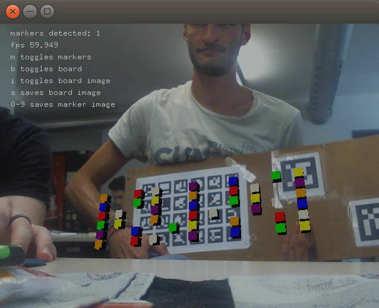
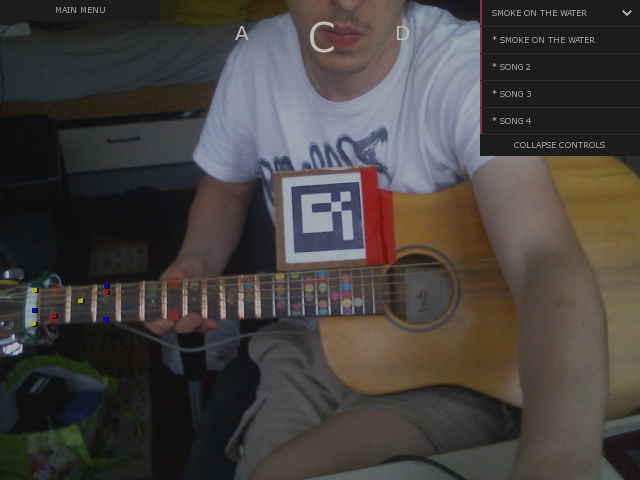

# Project log VRAR 2017 TU Darmstadt

This documents the progress, organization and remaining work of the VRAR project @ GRIS @ Tu Darmstadt of Simon Leischnig and Tim Unverzagt. In this repository also resides some part of the code that is working-state and extremely alpha until further notice.

The project started off on May 8th. Our goal [See the archived project pitch of the project which explains what we want to achieve.](doc/project_pitch.md).

- The project (in the scope of the VAR class 2017) in a nutshell:
  _A programm/app which tracks the guitar playing of the user visually and musically, offering optical support and lessons using augmented reality techniques_
- The big idea in a nutshell:
  _Provide a stable framework that allows recording of and experimenting with musical data, including aligning different streams of data in a single reference frame (e. g.: a song). The intention is to later be able to infer the data that was formerly recorded directly from sensors (e. g: instead of a electronically augmented guitar, use a regular one without electronics attached)_

That means, with the end of the project in the VR/AR class, we want to have a guitar that can be connected to the computer via USB and transmit insformation about what the user plays on it.

This document was started on June 19th 2017, at a state where the project seemed to slow down a little, in an effort to organize things better.

# Organization and project parts

Starting June 25, when the tracking of the guitar seemed to work (most vital part since we want to draw stuff on it at the right places) we split the workload in two tracks with frequent meeting and joint problem solving.

   * [Frontend / further improvement of ARuCo tracking / Teaching GUI and functionality  (Tim Unverzagt)](doc/frontend_tracking.md)

   

   * [Electronics / Hardware and communication programming / Documentation (Simon Leischnig)](doc/electronics.md)

   

# Subprojects and how to build

Our desktop applications are implemented within the [Openframeworks](http://openframeworks.cc) framework. To build these projects, please follow the installation instructions of Openframeworks, and when finished, copy the project you want to build inside the `$openframeworks$/apps/myApps` directory. Then, use the IDE for which you installed Openframeworks to build and run it. On linux, you can just execute `$ make RunRelease` inside the project.

We used several plugins, i. a. ofxAruco. To check which plugins you need, the file `addons.make` inside each project lists the names of those plugins. To install an Openframeworks plugin, just google it's github page, copy the git clone url (%giturl%). Then, go inside the %openframeworks%/addons folder and clone the plugin repository there -- e. g. `~/of/addons$ git clone %giturl%`.

The Arduino program for the USB guitar has to be compiled and transferred to the microcontroller. For testing, we used the official [Arduino IDE](https://www.arduino.cc/en/Guide/Linux).

Subprojects:

 - Arduino impolementation: **./arduino/**
 - Main "magic mirror" application: **./MarkerFetching/** (Openframeworks project)
 - Reference USB guitar state reader and visualization: **./guitarReader/**  (Openframeworks project)

# Discussion of the tools, problems and results.

[see here](doc/electronics.md)

# Project log with images of the progress

## Project inception - from April 24 to May 8

- Research and project pitch for the initial VAR Project kick-off
- [Original pitch](doc/project_pitch.md)
- Musical tracking solely by listening to the audio was already recognized as too difficult following the discussion in the literature that turned up during research
- Recognition of the guitar fretboard without markers seemed possible at the time, but we decided very early in favor of using simple ARuCo Markers first due to them having the better cost/benefit trade-off by far for the start of the project
- Tracking of the human hand was a big idea then, but now considered to be, if at all, only a thing for a very late stage of the project (e. g. when the electrically modified guitar is ditched)

# May 8 - May 22

 - Project pitch happened
 - Tim Unverzagt joined the project!
 - Experimentation with Unity + Vuforia for the graphical frontent and optical tracking, conclusion that we rather not use that (too much configuration by GUI and Wizards)
 - Research into the [CLAM project](http://clam-project.org/), a library and also
 framework to analyze, visualize, organize streams of musical data (inactive since 2011, but quite promising)
 - Research into hardware required to build something resembling the [OpenChord V1
 guitar](http://www.laboratoryspokane.com/openchord/the-openchord-v1-guitar/)
 as proposed in the project pitch

## May 22 - June 12
- Research into alternatives to Unity/Vuforia brought us to
  [OpenFrameworks](http://openframeworks.cc) (_"... is an open source C++ toolkit for creative coding"_), a C++ based framework giving easy access to community libraries, simplifying OpenGL and external hardware access. Despite being beginner-friendly, the implementor uses  100% written and inspectable code in contrast to Unity/Vuforia.
- Adaptation of OpenFrameworks for our project
- Switching platform from Windows 10 to Ubuntu 16.04
- Implementation of first optical ARuCo marker/guitar tracking in an OpenFrameworks project
- Display of static markers on a sudo guitar fretboard

  

## June 12 - June 25

- [Research and prototype design of the electrically augmented guitar, acquisition of materials](electronics.md)
- Documentation (hic)
- Concrete tracking and calibration for an old guitar.
- Code refactoring
- Organization: Splitting workloads into two tracks for the best part of the remaining time
   * Frontend / further improvement of ARuCo tracking / Teaching GUI and functionality  (Tim Unverzagt)
   * Electronics / Backend / Support / Documentation (Simon Leischnig)
- [Plan and schematics for the electronic guitar](doc/electronics.md)

  

## June 25 - July 7

- Finished the electronic guitar!
  - arduino code
  - wiring, fixation on the guitar
  - usb client application on the PC
- A bit of frontend work

  

 

## July 7 - July 17

 - Frontend track caught up
   - basic teaching and experimentation UI
   - two play-along-songs implemented: Seven Nation Army and Smoke on the Water
 - Drastically reduced communication lag with the USB guitar
 - Final presentation happened on the 17th

      
