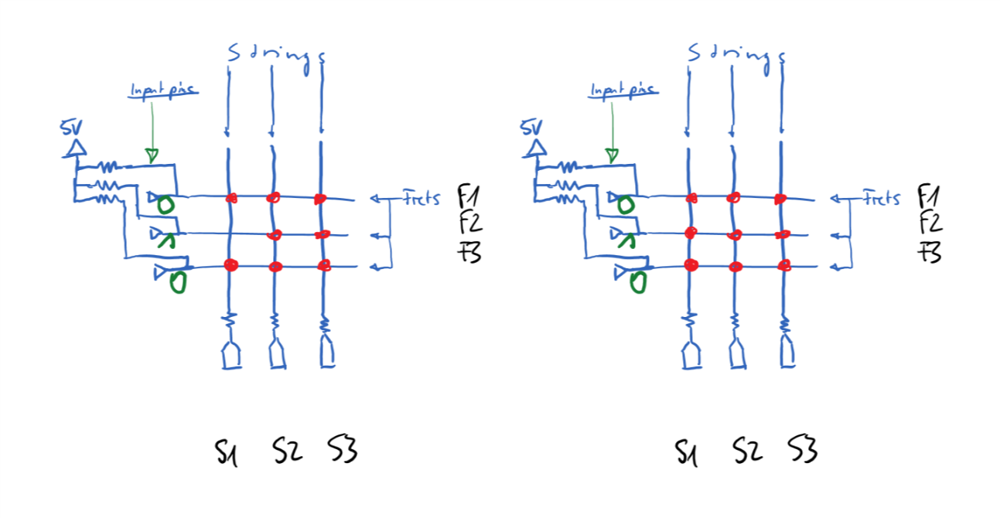

# Tools, Problems, Solutions analysis

A short discussion of the results after the final presentation on 17/07/2017 is given.

This page discussed the choice of tools for this project, the problems that have arisen,
and solutions / mitigations we have found.

# Discussion

- We built a guitar that transmits the string/fret contact state in real time to a desktop computer via USB. The lag of the transmission is neglegible.
 - We built a desktop application that tracks this guitar visually and can draw markers on the fingering positions, colored by index on the musical scale for sublime learning effect.
 - experimenttion mode which can display which note is pressed and can display to the user how to play the minor, major or seventh chord.
 - basic play-along functionality implemented

From the viewpoint of an exploratory project to see what can be achieved by reading an array of switches (formed by string/fret positions), we see this project as a success. We encountered a fundamental restriction that we were not initially aware of (see below in the problem section) and adapted our frontend implementation respectively. The electronics part works soundly and lag-free. The optical tracking of the guitar is not too bad; with a little bit of optimization, one could call it a non-intrusive experience. The frontent application is in exploration mode still, but demonstrates the things that can be done in theory quite well -- experimentation, and play-chords-along-a-song mode are in place.

Still, the mentioned problem with the electronics is a bit disheartening as it does not give us, as envisioned, the "perfect" and virtually lag-free monitoring of what the guitarist does with the guitar strings. Since we both have been very inexperienced with electronics when starting out into this project, we chalk that up as a valuable lesson on how to make an Arduino project that has to interoperate with a PC.

One has to note though, that more than one person much more knowledgeable than us, with whom we talked the electronics setup through at the start of the project, did not see the problem with the string-scanning approach coming, neither.

All in all, it was a very fascinating project, giving us the opportunity to learn something about the hardware and optical tracking that can be used to capture the real world of guitar playing.

# Tools

  - [OpenFrameworks](http://openframeworks.cc) (_"... is an open source C++ toolkit for creative coding"_), a C++ based framework giving easy access
    to community libraries, simplifying OpenGL and external hardware access. Despite being beginner-friendly, the implementor uses  100% written and inspectable code in contrast to Unity/Vuforia.

    We use Openframeworks to blend 3d graphics, Aruco Tracking and serial communication with the electronics easily into one application.

 - ARuCo tracking of the guitar body as it is a fast, tried & tested algorithm that we could handle in the time frame of the project
 - The [Arduino](http://arduino.cc) platform for reading out the guitar state reliably as it is arguably one of the most beginner-friendly electroncs platforms.
 - A Cort Earth Mini acoustic Western guitar to attach ARuCo markers and electronics to it.
 - Various stock electronics components

# Problems and their solution approaches

Minor problems have occurred all over the project, but when we were able to deal with them 100%, we don't list them here. Quality of the teaching matrial and user experience are not a major concern since we see this as an exploratory project for giving us a starting point for doing more work on detecting a guitar's state electronically and making that useful to the user.

Problems that were dealt with to our satisfaction at the final project presentations were:
  - ARuCo tracking dissatisfactory
  - Virtually no prior knowledge of electronics - but built the electronic guitar setup in short of 3 weeks!
  - Modeling of chords and their variations, scales, ... that were necessary for describing "lessons" for the user to play along with the usb guitar.
  - An electric guitar has a metallic bridge which is hard to isolate against thin metallic strings that eventually rub through all kinds of insulation. We ended up using a small western acoustic guitar which also has conductive strings but a wooden bridge.
  - all sorts of small problems while building the electronic guitar. aside from the problem with it discussed below, we think it's a real nice piece of DIY Human interface device electronics! :)

## Reading out the electronic guitar state

In the process of building the guitar, we realized we had misinterpreted some claims of a similar project that gave us the original idea for the electronic guitar approach. With multiple strings pressed on frets so that they make contact with other strings, we can not read the exact on/off state of all positions within a bounding box of those connected pressed fret positions. We originally thought, an approach that "scans" the strings one by one would disable all the switchingcapabilities of strings that are not "active" (connecting to GND) at that time, but forgot we cannot disable them being conductive. Thus, all fret positions that have contact with another string through a fret form a bounding box (see below) in which we cannot be sure how many positions are actually touching a fret.

In the following image, red points signify pressing down the string at that fret (fret and string have contact). AS described, the microcontroller has no means of telling the difference between those two configurations.

This is a problem with the general approach. After consulting with a few knowledgeable persons we confirmed our suspicion that we can just not do better than this approach with a string-fret-switches-kind-of approach. Thus, we implemented it anyway.

Keep in mind, if you press down just one finger on the guitar, say, for playing a simple melody - we can read that out perfectly and virtually without lag! Same goes for pressing down positions that are not connected via the frets. For full-blown chord detection though, we just get probable positions inside a bounding box. In this form, we can't perfectly detect a chord but it is still useful for user input via this guitar -- selecting a certain note and giving position information of the hand of the player. This may be complementary information for a computer vision or audio analysis approach.

## Quirks of the desktop app

 - we have not gotten the application to feature full-screen resolution for the day of the presentation which is admittedly a bit embarassing, We have just not gotten around to that in due time.
 - No play-along music for the lessons, it is hard to keep with the track in the lessons.
