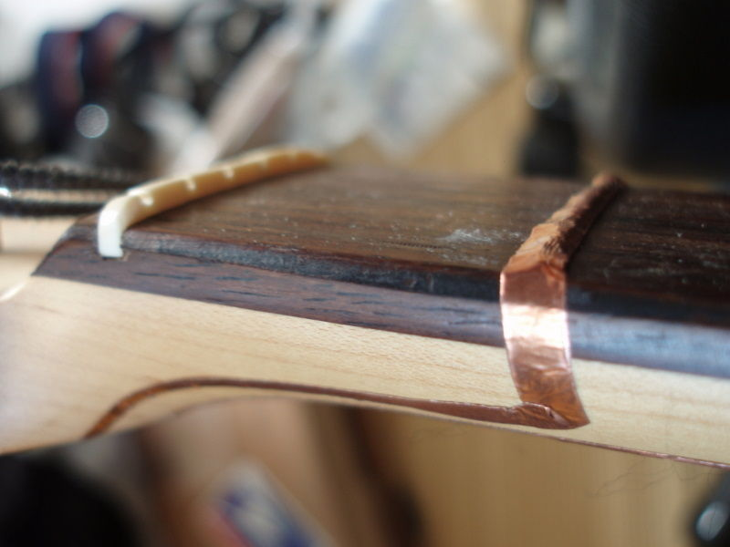
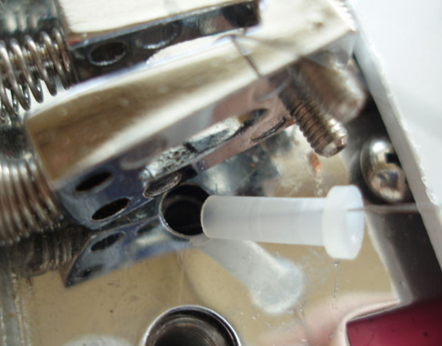
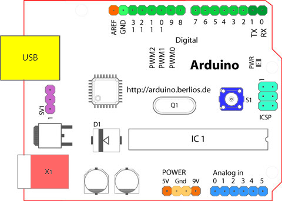
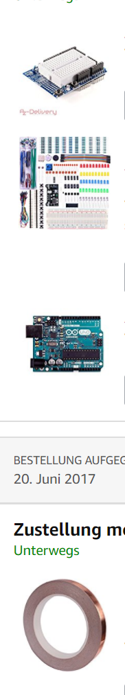

# electronic guitar planning stage - 25. 06. 2017

This document contains the planning of the electronically modified guitar. This document is the basis for an intermediary presentation.

_18. 07. 2017:_ While building the guitar, a fundamental problem with the scanning setup for the fret states has emerged. Still, the approach discussed here remained to the be most viable to get the guitar state information with a microcontroller using the strings as switches, we winded up implementing it as discussed here. We were just not aware of a restriction of the general direction of the approach that is due to properties of the guitar and can't be overcome without completely overthinking the approach which was not viable at this stage of the project. In a nutshell: with multiple strings pressed on frets so that they make contact with other strings, we can not read the exact on/off state of all positions within a bounding box of those connected pressed fret positions. This is discussed in the [Tools, Problems, Solutions analysis](doc/analysis.md) page that is part of the final project submission that took place on the 17. 07. 2017.

# Why we need a microcontroller on a guitar

At the start of the project, I spent the better part of two weeks looking at existing papers and projects
with goals similar to ours: to be able to tell what the hand of the guitar player
is doing, i. e. which combination of finger positions is in effect. Because we already
watch the player through a webcam, the computer vision approach seems like a natural
choice and there indeed already exists work on how to tell the finger position of a guitar player by analyzing a video feed.

It seemed though, that finger detection by computer vision in a manner precise and reliable enough to be useful for a music teaching application is quite a hard problem. [For more, read into the summary of the initial research (archived and w.r.t. the plan for how to do the project in part outdated)](project_pitch.md).

For being able to produce something that already works in the time frame of the Virtual and Augmented Reality class (where this project comes from, at GRIS at the TU Darmstadt), an invasive approach using a microcontroller seemed the most sensible choice, although we had never done anything like that before. This idea was inspired by a project called [OpenChord V1](http://www.laboratoryspokane.com/openchord/the-openchord-v1-guitar/). That project showed the viability of such an approach and that it could be done in a quite reasonable amount of time. I will be using some of the images of that project to illustrate the approach here, for as long as we have not yet arrived at a state where we can take those pictures for ourselves.

# Building the electronically augmented guitar

We want to modify a usual guitar so that the attached computer
(and thus, the frontend application) knows instantly which string is pressed down at
which fret.

How to do it? The guitar strings on western guitars and on electric guitars are usually
metallic and conduct electricity. That enables us to think about a guitar string
touching a fret as a switch. If a guitar string is pressed down, a circuit is closed. A microcontroller can read the switch configuration and transfer it to the application. [OpenChord](http://www.laboratoryspokane.com/openchord/the-openchord-v1-guitar/)
already built such a guitar and sold it. The project is dead now, but the author
published instructions on how to DIY. The OpenChord guitar featured a metallic guitar pick which supplied voltage to make the string switches work; we instead want to do it without such a tethered pick. We will lose the information on when the player strikes the guitar strings, but we are optimistic that at a later stage of the project this information can be automatically recovered from listening to the guitar audio, using the information which strings are currently fingered at which frets. This requires a fair amount of research into digital signal processing, but for now we will be content with knowing where thr strings are pressed without knowing the actual note onset times.

Since we initially had only very limited knowledge with the design of digital circuits and microcontrollers, we decided to keep it as simple as possible. Arduino is a platform that is well documented, has a huge community and is supposed to be very beginner-friendly. Before going for the setup with a real guitar, we can try out the circuit on a breadbord, simulating a fret contact by just pressing a switch or bringing two wires into contact.

# Guitar setup

An essential ingredient will be copper tape (conductive) to cover the frets.

Since the bridge of an electric guitar is made of metal, we will need to insulate the strings, ideally with such plastic tubes, but a makeshift replacement could be plastic straws or plain isolation tape (which is virtually guaranteed to not last long with the thin strings).

# Circuit

Unfortunately, there is a bit of difficulty here. If we just attach a microchip to a string, we can only tell by a logical "1" that this string had contact with a fret, but we don't have the information which fret it is. Thus, we need to be a little bit clever about it: we read out that switch bit one-by-one for each string, and do it so fast that it is not noticeable. A fret spans all 6 strings of the guitar. If two strings have contact with the same fret, the two switched circuits are connected, so we have to make sure that the currently active string (which we want to read out at this point) is the only string conducting digital information.

This is a sketch of the proposed switch circuit:

D0 to D5 are coupled to digital I/O pins of the microcontroller that are configured as digital output pins (can be connected to 5V or GND). They control, the state of which string is currently being read out. Since we are using a pull-up configuration for the input pins (see scheme in the circuit sketch), GND or "0" means the switch circuit is enabled, and 5V or "1" means the switch is disabled. Since we want to read out the strings one-by-one as discussed, only one of D0 to D5 can be at "0", and all others need to be at "1". The microcontroller then knows, to which string the information belongs that is read from D6 onward.

So, the pins D6 to (at maximum) D18 are attached to the frets of the guitar and are configured as digital input pins. Note, that we use a "pull-up resistor" configuration, which is shown only once for the sake of a concise sketch, but is part of the ciruitry that is attached to each fret.
Pull-up of input pins for a microcontroller are a common configuration; an Arduino board has the required resistors already built in!

# Controller

Here is a schematic of the Arduino UNO board:

Ostensibly, the board has 20 pins usable for digital I/O. 2 of them (RX, TX) are unusable though if you want to use USB for serial communication, so we have 18 digital I/O pins. Six of them (I called them D0 - D5) will be outputs to cycle through the single guitar strings. They need to be protected by resistors which are the green boxes in the circuit sketch. Their exact resistance value is yet to be calculated; the Arduino specs say we can sink-source a maximum of 35-40 mA on an output pin but we will aim for 20 mA.

On top of the Board, we will put a prototyping shield for easy experimentation. The following image shows my Amazon basket, containing the copper tape, Arduino, the shield and a starter kit for circuitry with more breadboards, resistors, wires, diodes and so on. We will also use a USB cable with on/off switch for serial communication with the application and 5V power supply.

# Code

We don't yet have Arduino code, but it should be fairly straightforward. The Arduino platform seems easy enough to program. One thing that may be a source of problems may be the efficient decoding and debouncing of the switch states, but we are confident that this is solveable.

The counterpart on the PC will consist of a little separate background program to which our guitar teaching application can register itself to receive the positions where the strings are pressed, with the zero-th fret being the pressed fret when nothing is touching the string.

# Current state

 - working concept done
 - obtained a "looks like it could work" from someone who knows circuitry
 - materials acquired
 - minimal knowledge of digital circuits acquired that may just do the trick; it is still a problem that we don't know the basics well. A little bit of knowledge is a dangerous thing...

The next step is to prototype on a breadboard and write the PC client program, then we have to actually attach it to a guitar and work toward putting everything in a casing, ideally detachable.

# Problems that may arise

1. An electric guitar may pick up the electric current being switched on and off in the strings.
2. We accidentally burn an Arduino by shorting something (due to lack of experience)
3. guitar strings rub through the insulation
4. Unforeseen problems with the circuit setup are virtually guaranteed with as little prior knowledge of the basics as ours

# Possible solutions

1. Use an acoustic guitar (ideally with a piezoelectric pickup for clean recording)
2. buy a new board or one of the cheaper clones
3. Improve method of insulation and restring
